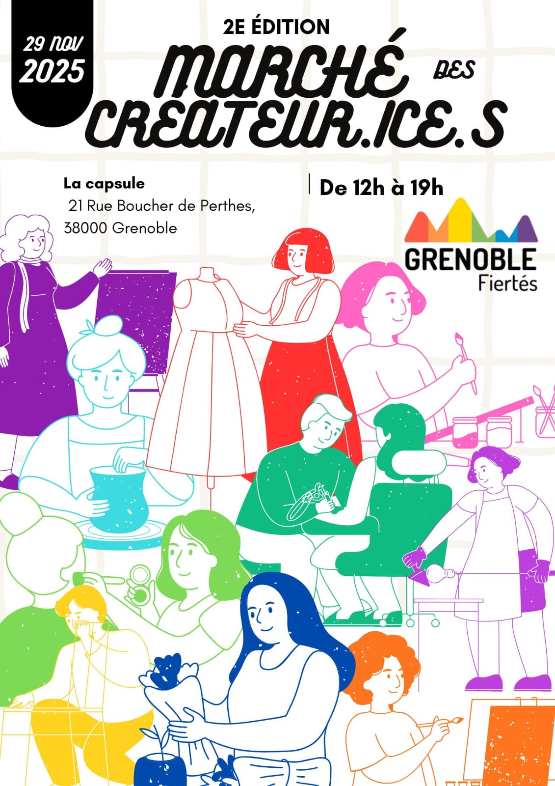

L'Édition 2026 de la Marche des Fiertés 2026 aura lieu le **20 Juin** au Jardin de Ville. 
 Notre mot d'ordre : **Queers en fête, fascisme en défaite !**
**La quinzaine des Fiertés aura lieu du 13 au 27 Juin**. Retrouvez tout le détail de cette édition (Village Associatif, Marche, programme...) en cliquant sur [Edition 2026](edition-2026), et les événements de la Quinzaine des Fiertés sur [Programme Quinzaine](edition-2026/programme). 

 

<!-- 

 -->