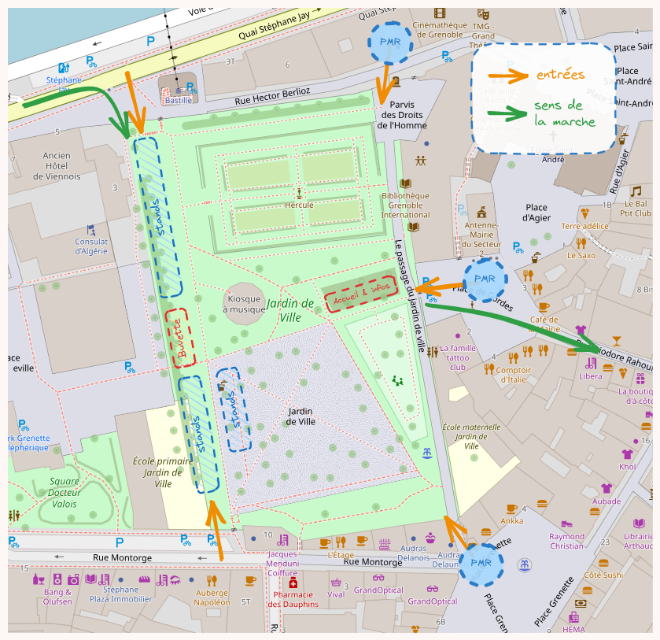
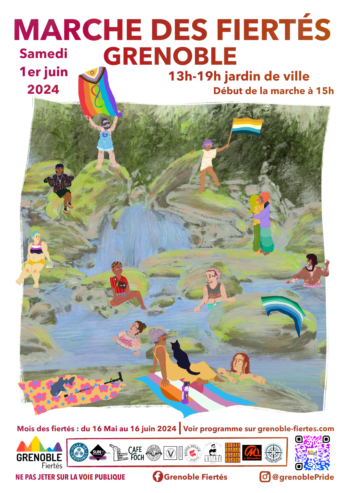

La Marche des Fiertés de Grenoble aura lieu le **<time datetime="2024-06-01">samedi 1 juin 2024</time>**.

## Déroulement de la journée

- **13h-15h :** performances et discours (collectif Libule, Irina, Mayb la Fabuleuse) 
- **15h-17h :** déambulation en ville 
- **17h-19h :** concert de M4uv3 et prises de parole

Et diverses after-prides, voir [le planning!](/edition-2024/programme)

## Village associatif

Le village associatif se tiendra de 13 heures à 19 heures au Jardin de Ville, y compris en l'absence de la Marche. De nombreuses associations LGBTQIA+ et féministes seront présentes : n'hésitez pas à leur rendre visite!

> **Associations présentes :**
> 
> - Centre LGBTI, Commission Asile, Commission Animation
> - Les Dépeauteuses, Les Dérailleurs, Grimpe et Glisse
> - Aides, Sida Info Service, Tempo, Enipse
> - Le Refuge, Contact, SOS homophobie, Amnesty International
> - Serein.es, Bon sang, Sans gametes, Le Planning Familial
> - La Quete 38, Rita, Déviations
> - Flam 38 ; Les Cannibal Marmots
> - DUEC
> - Vues d'en face, INPulse adelphie, En tout genre
> - Freesons , Rando's

## Mot d'ordre, parcours, cortège, etc

La Pride est un moment festif de célébration des diversités. C'est aussi et avant tout l'occasion de faire entendre nos revendications et valoir nos droits! Cette année, nous vous proposons de rassembler nos bannières autour du mot d'ordre suivant :

    <blockquote>
        Personnes LGBTQIA+, réfugiées, sans papiers, handicapées… Soutien à toutes les minorités et riposte contre les lois portées par les non-concerné.e.s et multi-privilégié.e.s
    </blockquote>

Le parcours de la marche se fera suivant une boucle depuis et vers le Jardin de Ville. 

<figure class="center">
    
</figure>

Au Jardin de ville, vous retrouverez les stands du village associatif ainsi qu'une buvette, vente de goodies, un pôle d'accueil, et spectacles / prises de paroles sur le kiosque.

<figure class="center">
    
</figure>

## Affiche et livret du programme

Cette année, l'affiche et illustrations du livret sont l'oeuvre de [Charlie-pour-les-intimes](https://www.instagram.com/charlie_pour_les_intimes/). Un grand merci à lui!

<figure class="center">
    
</figure>

Le livret du programme est quand à lui une super réalisation de Julie [[Web](https://www.julie-lambert.fr/) | [Insta ](https://www.instagram.com/fichtritudes/)], disponible [ICI](/documents/planning-fiertes-2024_compressed.pdf) en PDF compressé. Certains evènements pouvant être mis à jour, nous vous invitons aussi à regarder la version en ligne du [programme](/edition-2024/programme).

## Infos pratiques

Le Jardin de Ville se situe à proximité des arrêts Victor Hugo, Hubert Dubedout - Office du tourisme, Sainte Claire - Les Halles, et Notre Dame - Musée. Il est donc accessible avec les lignes de tram A et B, ainsi que les lignes de bus C1, C3 et C4.

Nous travaillons sur un plan du village associatif pour indiquer la présence de toilettes, de points d'eau, d'escaliers, des stands et de la musique, ainsi que des emplacements que nous souhaitons mettre en place cette année (point d'accueil et d'information, zone calme, point de distribution d'eau et de bouchons d'oreille…).

## [Partenaires](/edition-2024/partenaires)

Nous remercions chaleureusement nos partenaires et mécènes pour leur soutien (matériel, organisationnel, financier ...). Retrouvez-les [ici](/edition-2024/partenaires)!