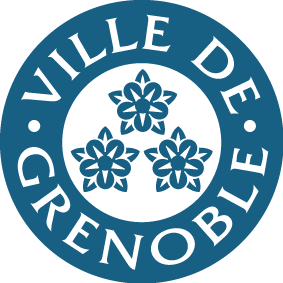
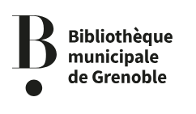
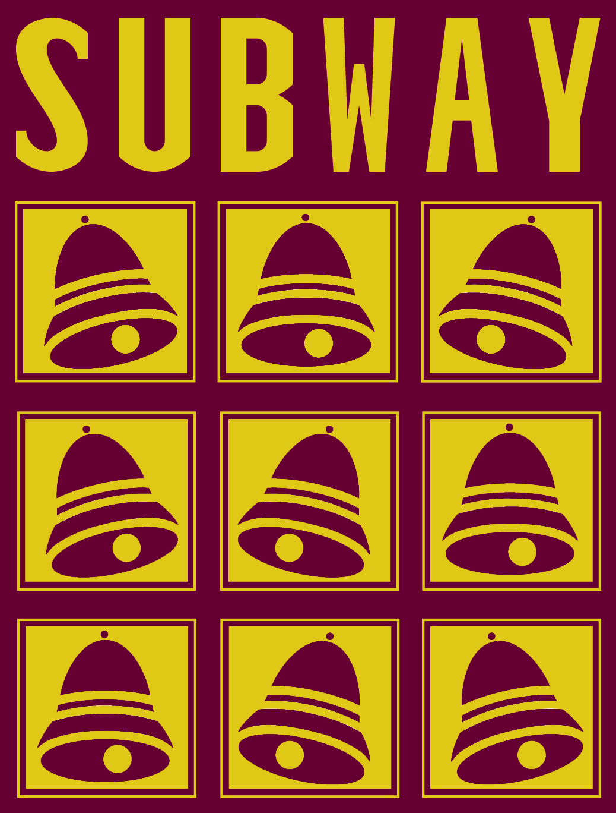
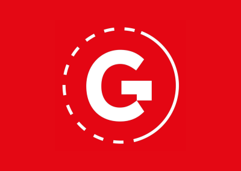

La marche et le mois des fiertés ne seraient pas possibles sans nos partenaires et/ou mécènes que nous remercions chaleureusement pour leur soutien matériel, organisationnel ou finacier 🌞.
Si vous souhaitez les rejoindre, n'hésitez pas à nous contacter !

