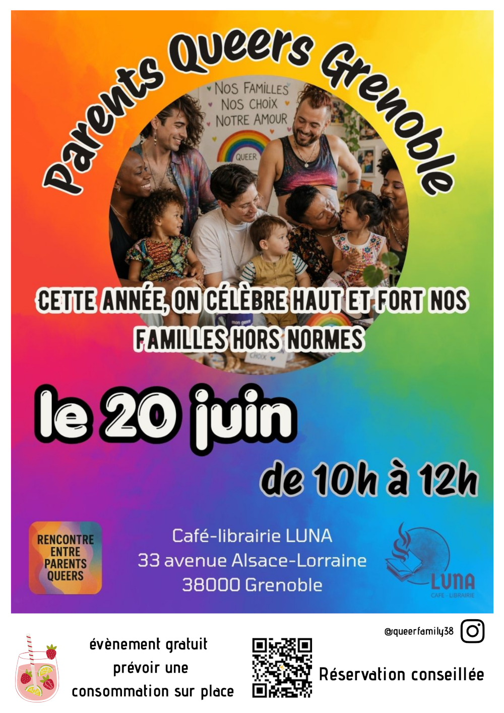

Cette année, on célèbre haut et fort nos familles hors normes, nos amours, nos choix, et nos manières de faire famille autrement .

Dans un lieu chaleureux et vivant, on se retrouve pour partager, échanger, s’informer et surtout se soutenir autour des parentalités queers.

Que tu sois déjà parent, coparent, en parcours PMA, en réflexion ou simplement curieux·se, toutes les formes de familles queers sont les bienvenues .

👉 Tu peux bien sûr venir aussi sans enfant !

Ici, pas de modèle unique : juste nos vécus, nos luttes, nos joies et nos solidarités ❤️

📍 RDV au Café Luna à Grenoble

🎟️ Entrée libre (consommation obligatoire, avec des prix accessibles et variés)

👶 Espace enfants prévu

♿ Accès PMR

🚻 WC non genrés

🧷 Table à langer disponible

Réservations conseillés

Viens comme tu es, avec ton histoire, tes questions, tes envies — notre collectif t’accueille à bras ouverts .

ACCÈS :

En transports en commun : arrêt Alsace-Lorraine (trams A et B devant la boutique, tram E et bus périurbains à 1 minute à pied)

En vélo : pistes Chronovélo 1 et 2 à proximité immédiate, nombreuses places de stationnement

En train : gare de Grenoble à 7 minutes à pied

En voiture : parking couvert Grenoble Estacade (22 Rue Colonel Denfert Rochereau) à 4 minutes à pied

***Lieu :*** Café Luna Grenoble

***Inscriptions :*** <https://www.onparticipe.fr/b/TtLowkaT>

***Organisateur.ices :*** Collectif Parents Queers Grenoble  @queerfamily38

Accessibilité PMR ♿

